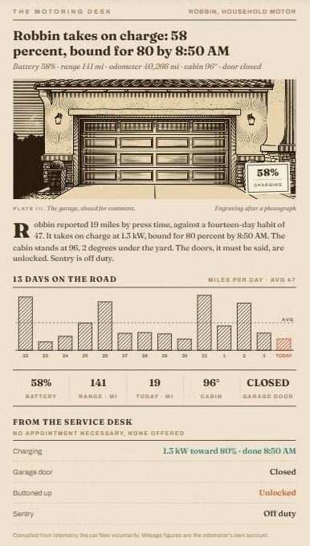

# Homestead Motoring Card

"The Motoring Desk" — an EV-and-garage news article for a newsprint Home Assistant dashboard. Companion to the [Almanac Weather Card](https://github.com/LoneWolf345/almanac-weather-card), the [Network Ledger Card](https://github.com/LoneWolf345/network-ledger-card), the [Homestead Classifieds Card](https://github.com/LoneWolf345/homestead-classifieds-card), the [Homestead Waterworks Card](https://github.com/LoneWolf345/homestead-waterworks-card) and the [Homestead Pool Card](https://github.com/LoneWolf345/homestead-pool-card).



**What it prints**

- **A woodcut plate of the garage front that mirrors reality.** Four plates (drawn from a photograph of the house): door **closed** · door **half-lowered** · open with **the car inside** · open and **empty**. The card picks one from the garage-door position sensor and the car's location — and the single spot of color is the car itself, so the plate literally loses its color when the car is out.
- **A state-driven headline** — charging ("Robbin takes on charge: 58 percent, bound for 80 by 8:50 AM"), away ("Robbin is abroad…"), resting, or "Not a mile turned today".
- **A drop-cap lede** with today's miles against the fourteen-day habit, the charge in progress, cabin vs yard temperature, an "unlocked, it must be said" clause when warranted, and the sentry's posture.
- **Days on the road** — hatched miles-per-day bars from recorder statistics of the odometer (`total_increasing`), today in terracotta, dashed average.
- **The strip** — battery · range · miles today · cabin · garage door.
- **The service desk** — charging detail, garage-door position, buttoned-up check (locks/doors/windows), sentry, and the soonest car chore from Maintenance Supporter (tire rotation and friends).

Read-only: tapping anything opens its more-info dialog.

## Requirements

- A car integration exposing battery/range/odometer etc. (here [Teslemetry](https://github.com/Teslemetry/hass-teslemetry)); the odometer needs `state_class: total_increasing` for the chart.
- Optional: a garage-door position sensor (here a Shelly BLU Door/Window tilt → template `%` sensor), plus the rest of the entities below.

## Installation (HACS)

1. HACS → Custom repositories → add this repo, category **Dashboard**
2. Install **Homestead Motoring Card**
3. Copy the plates from `docs/plates/` to `config/www/motoring/` (or draw your own garage)
4. Add the card:

```yaml
type: custom:homestead-motoring-card
name: Robbin
odometer_entity: sensor.robbin_odometer            # total_increasing, mi
battery_entity: sensor.robbin_battery_level
range_entity: sensor.robbin_battery_range
charging_entity: sensor.robbin_charging            # 'charging' when charging
charger_power_entity: sensor.robbin_charger_power  # kW
charge_limit_entity: number.robbin_charge_limit    # %
charge_done_entity: sensor.robbin_time_to_full_charge  # timestamp
cable_entity: binary_sensor.robbin_charge_cable
location_entity: device_tracker.robbin_location
inside_temp_entity: sensor.robbin_inside_temperature
outside_temp_entity: sensor.robbin_outside_temperature
lock_entity: lock.robbin_lock
sentry_entity: sensor.robbin_sentry_mode
doors: [binary_sensor.robbin_front_driver_door, binary_sensor.robbin_front_passenger_door, binary_sensor.robbin_rear_driver_door, binary_sensor.robbin_rear_passenger_door]
windows: [binary_sensor.robbin_front_driver_window, binary_sensor.robbin_front_passenger_window, binary_sensor.robbin_rear_driver_window, binary_sensor.robbin_rear_passenger_window]
door_position_entity: sensor.garage_door_position  # 0–100 %
door_binary_entity: binary_sensor.garage_overhead_door
chores:
  - { name: Tire rotation, entity: sensor.robbin_tesla_tire_rotation }
plates:
  car:    { src: /local/motoring/plate-car.jpg,    caption: Robbin at home, nose to the street. }
  empty:  { src: /local/motoring/plate-empty.jpg,  caption: The bay, unoccupied; color to return with the car. }
  half:   { src: /local/motoring/plate-half.jpg,   caption: The door, in two minds. }
  closed: { src: /local/motoring/plate-closed.jpg, caption: The garage, closed for comment. }
```

## Options

| Key | Default | Notes |
|---|---|---|
| `odometer_entity` | required | `total_increasing` miles; feeds the chart via recorder statistics |
| `battery_entity`, `range_entity` | `''` | %, mi |
| `charging_entity`, `charger_power_entity`, `charge_limit_entity`, `charge_done_entity`, `cable_entity` | `''` | Charge state ('charging'), kW, %, finish timestamp, cable binary |
| `location_entity` | `''` | `home` → the car plate; anything else → the empty bay |
| `inside_temp_entity`, `outside_temp_entity` | `''` | Cabin vs yard line |
| `lock_entity`, `doors`, `windows`, `sentry_entity` | `''` / `[]` | Buttoned-up row and lede clause |
| `door_position_entity` | `''` | 0–100 %; ≥60 open plate, 1–59 half plate, 0 closed |
| `door_binary_entity` | `''` | Fallback when no position sensor |
| `chores` | `[]` | `[{name, entity}]` Maintenance Supporter sensors |
| `plates` | `{}` | `car` / `empty` / `half` / `closed` → `{src, caption}` |
| `name`, `title`, `kicker` | `Robbin`, `THE MOTORING DESK`, `<NAME>, HOUSEHOLD MOTOR` | Copy identity |
| `plate_number`, `plate_credit`, `tag_position` | `III`, `Engraving after a photograph`, `br` | Plate furniture |
| `days`, `footer`, `column_rule` | `14`, house line, `false` | |

## Theming

Honors `--almanac-paper` (set `transparent` for a one-sheet newspaper look), `--almanac-column-rule`, `--almanac-gutter`, `--ha-card-border-radius` / `--ha-card-box-shadow`. The card remembers its rendered height per device and pins it across re-renders so phones don't jump.

## Plates

`docs/plates/`: `car.jpg`, `empty.jpg`, `half.jpg`, `closed.jpg` — the house's own garage front, drawn from a photograph as woodcuts (brown ink on cream; a single terracotta spot on the car, everything else monochrome), 912×387, printed in multiply. `car-warmroof-alternate.jpg` keeps the terracotta roof tiles.
